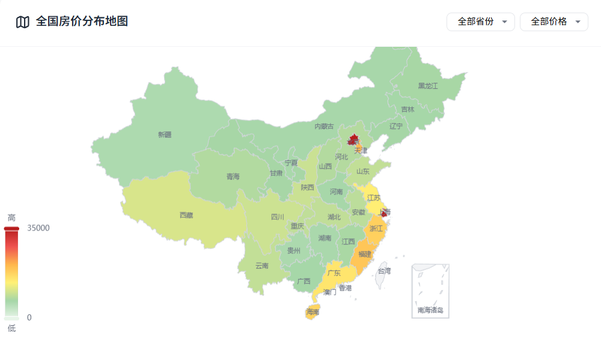
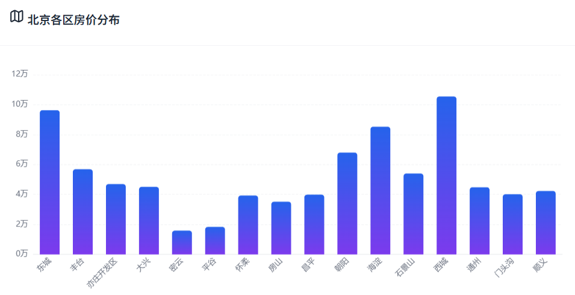
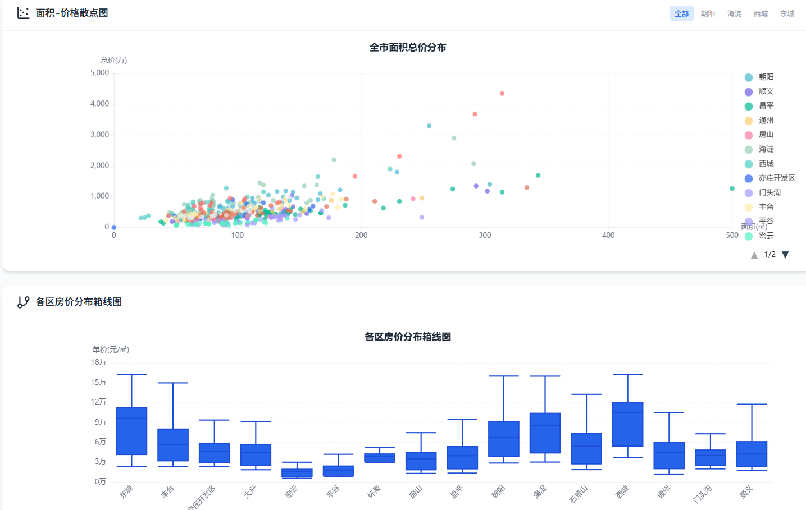
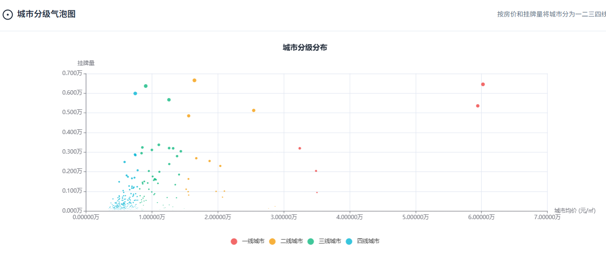
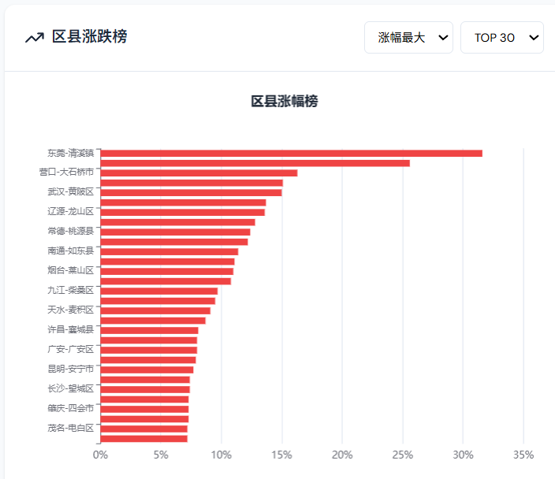

# 房产数据分析系统

基于Flask + SQLite的房产数据分析与AI报告生成系统，提供北京房产数据查询、可视化分析、智能对话和AI报告生成功能。

## 📋 项目简介

本系统是一个全栈房产数据分析平台，整合了数据采集、存储、分析和智能报告生成功能。用户可以通过Web界面查询房产信息、查看数据分析图表、与AI对话获取房产建议，以及生成专业的数据分析报告。

### 主要功能

- **数据查询**：支持按区域、价格、户型等多维度查询房源信息
- **数据可视化**：提供多种图表展示房价趋势、区域分布、价格分析等
- **AI对话助手**：集成大语言模型，提供智能房产咨询服务
- **报告生成**：自动生成房产数据分析报告（文本格式）
- **用户系统**：完整的用户注册、登录、权限管理功能
- **历史记录**：保存用户查询和报告历史

## 📸 系统展示



<div align="center">
  
  
</div>

<div align="center">
  
  
</div>

<div align="center">
  
  
</div>

<div align="center">
  
  
</div>

## 🏗️ 技术栈

### 后端
- **框架**：Flask 2.x
- **数据库**：SQLite 3
- **AI服务**：讯飞星火API
- **数据处理**：Pandas, NumPy, SciPy
- **认证**：Session-based Auth

### 前端
- **基础**：HTML5, CSS3, JavaScript (ES6+)
- **UI框架**：自定义响应式设计
- **图表库**：ECharts
- **通信**：Fetch API

## 📁 项目结构

```
py_spider/
├── project/                      # 后端主目录
│   ├── serve_new.py             # Flask应用入口
│   ├── house_data.sqlite        # SQLite数据库文件
│   ├── routes/                  # 路由模块
│   │   ├── auth_routes.py       # 认证路由
│   │   ├── user.py              # 用户管理路由
│   │   ├── report_routes.py     # 报告路由
│   │   ├── system_routes.py     # 系统路由
│   │   └── chart_routes.py      # 图表路由
│   ├── services/                # 业务逻辑层
│   │   └── data_service.py      # 数据服务
│   ├── report/                  # 报告生成模块
│   │   ├── reportDB.py          # 报告数据库操作
│   │   ├── ai_service.py        # AI服务封装
│   │   └── task_manager.py      # 任务管理
│   ├── tools/                   # 工具模块
│   │   └── house_query.py       # 房源查询工具
│   ├── utils/                   # 工具函数
│   │   ├── database.py          # 数据库连接池
│   │   └── auth.py              # 认证工具
│   ├── LLM/                     # AI配置
│   └── reports_storage/         # 报告存储目录
│       ├── texts/               # 文本报告
│       └── images/              # 图片资源
├── project_web/                 # 前端目录
│   ├── index.html               # 首页
│   ├── login.html               # 登录页
│   ├── beijing.html             # 北京数据页
│   ├── report.html              # 报告页
│   ├── css/                     # 样式文件
│   ├── js/                      # JavaScript文件
│   └── images/                  # 静态图片
└── README.md                    # 项目说明文档
```

## 🚀 快速开始

### 环境要求

- Python 3.8+
- SQLite 3
- 现代浏览器（Chrome、Firefox、Edge等）

### 安装步骤

1. **克隆项目**
```bash
git clone <repository-url>
cd py_spider
```

2. **安装依赖**
```bash
pip install -r requirements.txt
```

或手动安装：
```bash
pip install flask pandas numpy scipy requests python-dotenv websocket-client
```

3. **配置环境变量**

复制环境变量模板文件并配置：
```bash
cp .env.example .env
```

编辑 `.env` 文件，填入必要的配置：

```env
# Flask应用配置
FLASK_SECRET_KEY=your-random-secret-key-here
FLASK_DEBUG=False
FLASK_HOST=0.0.0.0
FLASK_PORT=5000

# 讯飞星火API配置（必需，用于AI功能）
SPARK_APPID=your_spark_appid
SPARK_API_SECRET=your_spark_api_secret
SPARK_API_KEY=your_spark_api_key
SPARK_API_HOST=wss://spark-api.xf-yun.com/v3.5/chat

# 讯飞星火图片生成API配置（可选）
SPARK_IMAGE_APPID=your_spark_image_appid
SPARK_IMAGE_API_SECRET=your_spark_image_api_secret
SPARK_IMAGE_API_KEY=your_spark_image_api_key
SPARK_IMAGE_API_HOST=http://spark-api.cn-huabei-1.xf-yun.com/v2.1/tti
```

**获取讯飞星火API密钥**：
- 访问 [讯飞开放平台](https://www.xfyun.cn/)
- 注册并创建应用
- 在控制台获取 `APPID`、`API_SECRET`、`API_KEY`

4. **配置数据库**

确保数据库文件存在：`project/house_data.sqlite`

5. **启动服务**
```bash
cd project
python serve_new.py
```

6. **访问系统**

打开浏览器访问：`http://localhost:5000`

默认配置在 `.env` 文件中，可根据需要修改端口和主机地址。

## 📊 数据库说明

### 主要数据表

- **beijing_house_info**：北京房产基础信息
- **trend**：房价趋势数据
- **users**：用户信息表
- **reports**：报告记录表
- **report_history**：报告历史记录
- **user_sessions**：用户会话表

### 数据库配置

数据库配置位于 `project/utils/database.py`：

```python
DB_TYPE = 'sqlite'
DB_CONFIG = {
    'database': os.path.join(_PROJECT_DIR, 'house_data.sqlite')
}
```

## 🔌 API接口

### 认证接口
- `POST /api/auth/login` - 用户登录
- `POST /api/auth/logout` - 用户登出
- `POST /api/auth/register` - 用户注册

### 数据查询接口
- `GET /api/beijing/overview` - 北京房产概览
- `GET /api/beijing/district-ranking` - 区域价格排名
- `GET /api/beijing/district-prices` - 区域价格详情
- `GET /api/beijing/analysis/orientation` - 朝向分析
- `GET /api/beijing/analysis/layout` - 户型分析
- `GET /api/beijing/chart/scatter` - 散点图数据
- `GET /api/beijing/chart/boxplot` - 箱线图数据

### 报告接口
- `POST /api/reports/generate` - 生成报告
- `GET /api/reports/history` - 报告历史
- `GET /api/reports/<report_id>` - 获取报告详情
- `DELETE /api/reports/<report_id>` - 删除报告

### 用户接口
- `GET /api/user/profile` - 获取用户信息
- `PUT /api/user/profile` - 更新用户信息
- `GET /api/user/reports` - 用户报告列表

## 🤖 AI功能

系统集成了讯飞星火大模型，提供以下AI功能：

1. **智能对话**：与AI助手对话，获取房产建议
2. **报告生成**：基于数据自动生成分析报告
3. **数据解读**：智能解读房产数据趋势

### AI配置说明

1. **注册讯飞星火API**
   - 访问 [讯飞开放平台](https://www.xfyun.cn/)
   - 注册账号并实名认证
   - 创建应用（选择"星火认知大模型"）
   - 在控制台获取密钥

2. **配置环境变量**
   
   在 `.env` 文件中填入获取的密钥：
   ```env
   SPARK_APPID=your_appid_here
   SPARK_API_SECRET=your_api_secret_here
   SPARK_API_KEY=your_api_key_here
   ```

3. **验证配置**
   
   启动服务时会自动验证配置，如未配置会显示警告但不影响其他功能使用。

## 🔒 安全说明

- 用户密码采用SHA256哈希存储
- Session-based认证机制
- API接口权限验证
- SQL注入防护（参数化查询）
- 敏感配置通过环境变量管理

⚠️ **生产环境部署建议**：
1. 修改 `.env` 中的 `FLASK_SECRET_KEY` 为强随机字符串（建议使用 `python -c "import secrets; print(secrets.token_hex(32))"`）
2. 设置 `FLASK_DEBUG=False` 关闭调试模式
3. 启用HTTPS
4. 配置防火墙规则
5. 定期备份数据库
6. **重要**：确保 `.env` 文件不被提交到版本控制系统（已在 `.gitignore` 中配置）

## 🛠️ 开发说明

### 添加新功能

1. 在 `routes/` 目录创建新的路由模块
2. 在 `services/` 目录添加业务逻辑
3. 在 `serve_new.py` 中注册蓝图
4. 在前端添加对应页面和JS逻辑

### 数据库迁移

系统已从MySQL迁移到SQLite，SQL语法差异：
- 占位符：`%s` → `?`
- 时间函数：`NOW()` → `datetime('now')`
- 字符长度：`CHAR_LENGTH()` → `LENGTH()`
- 正则匹配：`REGEXP` → `LIKE`

## 📝 更新日志

### v2.1 (2025-01-08)
- ✅ 配置管理重构：使用环境变量管理敏感配置
- ✅ 添加 `.env` 支持，提升安全性
- ✅ 创建统一的配置管理模块 `config.py`
- ✅ 更新文档，添加详细的配置说明

### v2.0 (2025-01)
- ✅ 完成MySQL到SQLite数据库迁移
- ✅ 移除封面图片生成功能
- ✅ 修复SQL兼容性问题（`CHAR_LENGTH`、`REGEXP`等）
- ✅ 优化数据库连接池管理
- ✅ 统一API错误处理
- ✅ 修复图表导入和数据库路径问题

### v1.0
- 初始版本发布
- 基础数据查询功能
- AI报告生成功能
- 用户系统

## 🤝 贡献指南

欢迎提交Issue和Pull Request！

## 📄 许可证

本项目仅供学习和研究使用。

## 📮 联系方式

如有问题或建议，请提交Issue。

---

**注意**：本系统中的房产数据仅供参考，实际购房决策请咨询专业机构。
